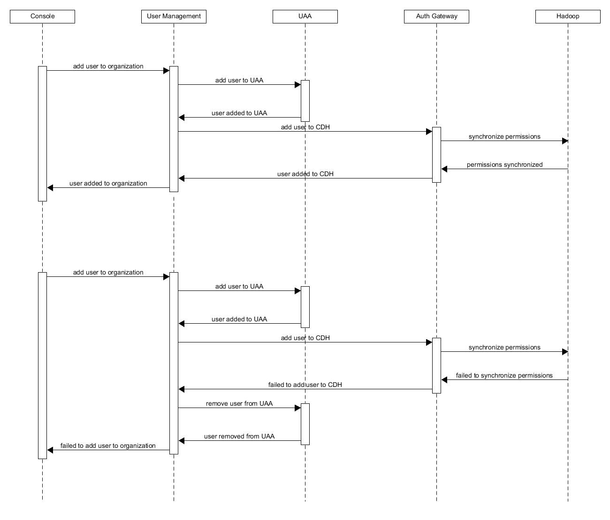

User management
==========

The primary responsibility of this service is the management of users in the platform. There are two ways in which you can become a user:

* Global SysOp invitation. Admin user can send a email with invitation to create an organization and Org SysOp account;
* Org SysOp invitation. Org SysOp can create new accounts for org users and send email with instructions how to log in.

The service allows for SysOps not only invite new users, but also remove them and give them a role inside organization.
All of these operations are performed against UAA and Auth-gateway.

Request flow
-----------------

Please note that diagram presents simplified flow by not including the part where user receives email with invitation. After clicking the
link the process of adding user to organization starts. In case of 0.8 version we are supporting only one organization and therefore inviting
user to the platform is the same as adding user to the organization.
In case of any failures we try to keep consistent state and therefore failure when synchronizing user permissions with hadoop implies removing
him from uaa.

Required services
-----------------
User-management requires following service to function properly:

* **SMTP** - to send invitation emails;
* **Redis DB** - for storing security codes.
* **SSO** - a collection of URLs needed for Single Sign On functionality (UAA endpoints, client credentials etc.)

Required libraries
-----------------
Following libraries are necessary to successfully build user-management:

* **uaa-lib** - separate library to communicate with UAA.

Security
--------
The RESTful endpoints provided by this service are protected by OAuth2. User management is a Resource Server and requires valid Acces Token for communication.
There are actually two tokens used:

* **user AT** - obtained from HTTP header from request a user comes with. It's used for majority of the communications with UAA.
* **client AT** - required to create new accounts in UAA. This token is obtained from UAA by means of client grant type.

How to build
------------
It's a Spring Boot application build by maven. All that's needed is a single command to compile, run tests and build a jar:

```
$ mvn verify
```

How to run locally
------------------
To run the service locally or in Kubernetes cluster, the following environment variables need to be defined:

* `SERVER_PORT` - User Management server port;
* `SSO_TOKENURI` - UAA endpoint for getting tokens;
* `SSO_AUTHORIZATIONURI` - OAuth authorization endpoint;
* `SSO_CLIENTID` - client ID used for OAuth authorization;
* `SSO_CLIENTSECRET` - client secret used for OAuth authorization;
* `SSO_TOKENKEY` - UAA endpoint for verifying token signatures;
* `SSO_UAAURI` - UAA service address;
* `SSO_EMAIL` - email for  OAuth authorization;
* `SMTP_HOST` - SMTP host name;
* `SMTP_PORT` - SMTP server port;
* `SMTP_PROTOCOL` - SMTP protocol;
* `SMTP_USERNAME` - user name for authorization to SMTP server;
* `SMTP_PASSWORD` - password for authorization to SMTP server;
* `SMTP_EMAIL` - email for SMTP server;
* `CONSOLE_HOST` - Console application host name;
* `AUTHGATEWAY_HOST` - Auth Gateway application host name;

There are meaningful configuration values provided that allow for local testing. The server can be run by maven spring boot plugin:

```
$ mvn spring-boot:run -Dspring.cloud.propertiesFile=spring-cloud.properties
```

After server has been started an ordinary curl command can be used to test the functionality, i.e.:

```
$ curl http://localhost:9998/rest/orgs/69e8563a-f182-4c1a-9b9d-9a475297cb41/users -v -H "Authorization: `cf oauth-token|grep bearer`"
```
